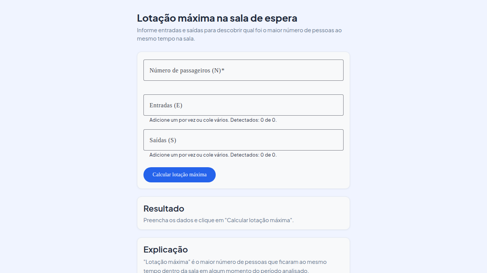
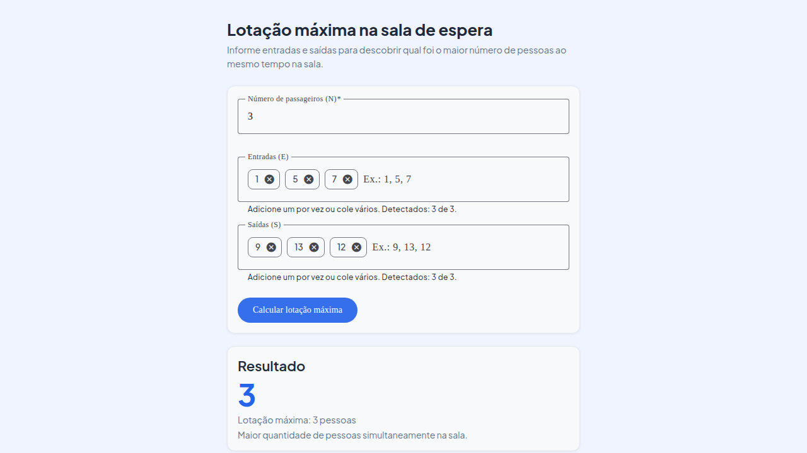

# Máxima Ocupação em Salas de Espera

Calcule a lotação máxima de uma sala de espera baseando-se no histórico de entrada e saída de passageiros. Uma solução simples, precisa e apresentável para análise de capacidade em aeroportos.

## O Problema

Salas de espera em aeroportos precisam ser dimensionadas adequadamente para acomodar passageiros com segurança e conforto. O desafio: **qual foi a lotação máxima (maior número de pessoas ao mesmo tempo) durante um período específico?**

Dado um conjunto de horários de entrada e saída de passageiros, a solução calcula em tempo real qual foi o pico de ocupação, facilitando decisões sobre redimensionamento e planejamento de capacidade.

## A Solução

Uma aplicação web moderna composta por:

- **Frontend Angular** — Interface intuitiva para inserir dados e visualizar resultados em linguagem acessível
- **API REST Spring Boot** — Processamento robusto com validações de segurança e algoritmo eficiente
- **Documentação Técnica** — Explicações claras para stakeholders e desenvolvedores

### Como Funciona

1. Informe a quantidade de passageiros (N), os instantes de entrada (E) e saída (S)
2. A API processa os dados com um algoritmo de varredura temporal eficiente
3. Receba instantaneamente a lotação máxima com uma explicação clara

**Regra de negócio:** Se um passageiro sai exatamente quando outro entra, a ocupação não aumenta naquele instante — considera-se como troca sem pico adicional.

## Começando

### Pré-requisitos

- **Java 25** (para o backend)
- **Node.js 20+** (para o frontend)

### Execução Local

#### Backend (API REST)

```bash
cd backend
./mvnw spring-boot:run
```

A API estará disponível em `http://localhost:8080` com documentação interativa em `/swagger-ui.html`

#### Frontend (Interface Web)

```bash
cd frontend
npm install
npm start
```

A aplicação abrirá em `http://localhost:4200`

## Estrutura do Projeto

```
.
├── backend/              # API REST (Spring Boot 4, Java 25)
│   ├── src/main/java/    # Código-fonte da API
│   └── pom.xml           # Dependências Maven
├── frontend/             # Interface Web (Angular 21, TypeScript 5)
│   ├── src/              # Código-fonte da aplicação
│   └── package.json      # Dependências npm
├── docs/                 # Documentação
│   ├── solution-overview.md      # Visão geral da solução
│   ├── system-architecture.md    # Arquitetura do sistema
│   ├── algorithm-design.md       # Design técnico do algoritmo
│   └── ux-design.md              # Decisões de UX/UI
└── e2e/                  # Testes end-to-end
```

## API REST

### Endpoint Principal

```http
POST /api/lotacao-maxima
```

**Requisição:**
```json
{
  "quantidadePassageiros": 3,
  "temposEntrada": [1, 5, 7],
  "temposSaida": [9, 13, 12]
}
```

**Resposta (sucesso):**
```json
{
  "lotacaoMaxima": 3
}
```

**Resposta (erro de validação):**
```json
{
  "erro": "A quantidade de tempos de saída não corresponde à quantidade de passageiros"
}
```

### Validações

- `quantidadePassageiros`: entre 1 e 100
- `temposEntrada` e `temposSaida`: exatamente `quantidadePassageiros` valores
- Cada tempo: inteiro entre 1 e 1000
- `temposEntrada[i] <= temposSaida[i]`: entrada não pode ser após saída

Consulte a documentação completa em `/api/docs` ou `/swagger-ui.html` após iniciar o backend.

## Tecnologias

### Backend
- **Java 25** — Linguagem
- **Spring Boot 4** — Framework web
- **SpringDoc OpenAPI 3.0** — Documentação automática
- **Maven** — Gerenciamento de dependências

### Frontend
- **TypeScript 5** — Linguagem tipada
- **Angular 21** — Framework
- **Angular Material** — Componentes de UI
- **Vitest** — Testes unitários
- **npm** — Gerenciador de pacotes

## Validação e Testes

### Backend

```bash
cd backend
./mvnw clean package  # Compila, testa e empacota
```

### Frontend

```bash
cd frontend
npm run build     # Compila para produção
npm run test      # Executa testes unitários
```

### Testes End-to-End (Playwright)

A solução inclui testes automatizados com Playwright que validam:
- **Validações de formulário** — campos obrigatórios, limites de valores, consistência
- **Comportamento da UI** — carregamento, exibição de erros, formatação de entrada
- **Cenários de cálculo** — exemplos da especificação e casos extremos

```bash
cd e2e
npm install
npm test                    # Executa todos os testes
npx playwright test --ui    # Executa com interface visual
npx playwright test --debug # Executa em modo debug
```

## Screenshots

### Tela Inicial



### Resultado do Cálculo



## Documentação Completa

- **[Visão Geral da Solução](docs/solution-overview.md)** — Entenda o problema, a solução proposta e o fluxo de informação
- **[Arquitetura do Sistema](docs/system-architecture.md)** — Arquitetura C4, componentes e responsabilidades
- **[Design do Algoritmo](docs/algorithm-design.md)** — Detalhes técnicos do algoritmo de sweep line, complexidade e justificativas
- **[Design de UX](docs/ux-design.md)** — Decisões de interface, validações e linguagem acessível
