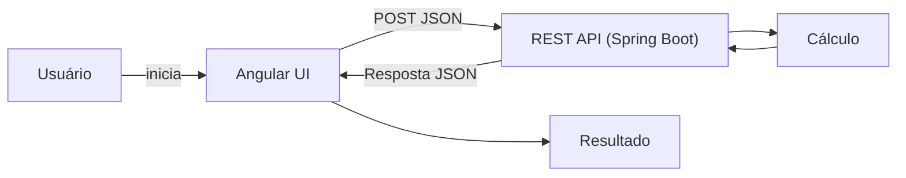

# Visão Geral da Solução (High-Level Design)

## 1) Problema
A Atech foi solicitada a apoiar um estudo de **redimensionamento de salas de espera** em aeroportos. O objetivo é identificar, com base em dados históricos, **qual foi a lotação máxima** (maior número de passageiros ao mesmo tempo) em cada sala ao longo de um período.

Para facilitar a análise, os horários foram previamente transformados em **instantes numéricos (1 a 1000)**, preservando a ordem temporal.

Isso reduz risco de subdimensionamento (conforto/segurança/operação) e embasa decisões de capacidade com dados.

## 2) Solução proposta
Entregar uma solução simples e demonstrável, composta por:

- **Interface Web** para inserir conjuntos de dados (N, E, S) e visualizar o resultado.
- **API REST** que recebe os dados, executa o cálculo de lotação máxima e retorna o valor.
- **Explicação acessível** na interface (para stakeholders) e um **texto técnico** junto ao código (para desenvolvedores).

O cálculo de lotação máxima usa um algoritmo eficiente de varredura temporal ("sweep line"), respeitando a regra de negócio: **se alguém entra no mesmo instante em que outro sai, a saída é contabilizada antes** (não aumenta a lotação naquele instante).

## 3) Principais componentes

### Frontend (Angular + Angular Material)
Responsável por:
- Coletar os valores **N**, **E** (entradas) e **S** (saídas).
- Validar o formato (ex.: tamanhos consistentes, valores no intervalo esperado).
- Acionar a API e exibir:
  - Lotação máxima calculada.
  - Explicação resumida (não técnica) do “porquê” do resultado.

### Backend API (Spring Boot)
Responsável por:
- Expor endpoint REST para cálculo (ex.: `POST /api/.../lotacao-maxima`).
- Validar entrada (obrigatoriedade de N/E/S, limites, consistência).
- Executar o algoritmo e retornar resposta estruturada (JSON) com:
  - `lotacao-maxima` (resultado)
  - (opcional) metadados úteis para UI, como mensagens/observações.

## 4) Fluxo geral da informação (end-to-end)

1. Usuário informa o conjunto de dados na UI:
   - **N** = quantidade de passageiros
   - **E** = lista de instantes de entrada
   - **S** = lista de instantes de saída
2. Frontend valida e envia para a API via HTTP `POST`.
3. Backend valida novamente (segurança/robustez) e transforma os dados em eventos de tempo.
4. Backend calcula a lotação máxima ao percorrer os eventos ordenados:
   - **Saídas antes de entradas no mesmo instante** (regra de negócio).
5. Backend retorna a resposta JSON.
6. Frontend exibe o valor final e a explicação ao público.

### Representação do fluxo

## 5) Observações de design
- **Separação de responsabilidades**: UI focada em experiência e narrativa; API focada em validação e cálculo.
- **Determinismo e reprodutibilidade**: mesmos inputs produzem mesmo output.
- **Escopo**: o core é o cálculo por conjunto de dados.
