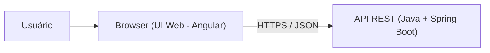
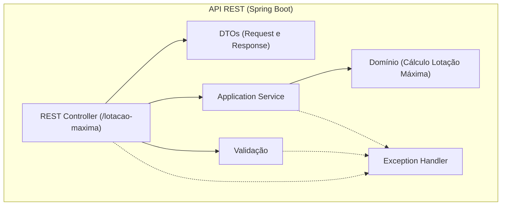

# Arquitetura do Sistema

Este documento descreve a **arquitetura proposta** para a solução de cálculo da **lotação máxima** de uma sala de espera, baseada nos dados (N, E, S) informados na interface.

> Objetivo arquitetural: separar bem **experiência (Frontend)** de **cálculo (Backend)**, mantendo o sistema simples (sem overengineering) para um problema pequeno e determinístico.

## 1) Tecnologias usadas

### Frontend (UI Web)
- **TypeScript 5**
- **Angular 21**
- **Angular Material**

**Papel**: coletar os dados, aplicar validações básicas de formato e apresentar o resultado com uma explicação leiga.

### Backend (API REST)
- **Java 25**
- **Spring Boot 4**

**Papel**: expor uma API REST para receber N/E/S, validar regras e executar o algoritmo (sweep line), retornando o valor da lotação máxima.

> Observação: o escopo atual **não exige** banco de dados, mensageria ou cache. O cálculo é rápido, idempotente e feito “on demand”.

## 2) C4 – Nível 2 (Containers)

### Diagrama (Containers)



### Responsabilidades por container

**Browser (UI Web)**
- Entrada de dados: N, lista E (entradas) e lista S (saídas).
- Validações de UX (antes de chamar a API):
  - campos obrigatórios presentes
  - tamanhos de E e S compatíveis com N
  - valores numéricos no intervalo esperado (ex.: 1..1000)
- Apresentação:
  - exibir a lotação máxima
  - explicar de forma simples “por que” aquele número apareceu (sem linguagem técnica)

**API REST (Java)**
- Validar entrada de forma **defensiva** (não confiar na UI):
  - N dentro do limite
  - E e S com tamanho N
  - instantes coerentes (ex.: entrada <= saída)
- Executar o algoritmo de cálculo respeitando a regra de negócio:
  - **se alguém entra no mesmo instante que outro sai, a saída conta primeiro** (não aumenta a lotação naquele instante)
- Retornar resposta JSON com o resultado.

## 3) Comunicação entre frontend e backend

### Estilo de integração
- **HTTP/HTTPS** com **JSON**.
- 1 chamada principal (por dataset): a UI envia (N, E, S) e recebe o resultado.

### Contrato de dados (conceitual)
**Request**
```json
{
  "n": 3,
  "e": [1, 5, 7],
  "s": [9, 13, 12]
}
```

**Response**
```json
{
  "lotacaoMaxima": 3
}
```

### Erros e validação
- Erros de validação devem retornar **4xx** com mensagem clara (para a UI exibir de forma amigável).
- Erros inesperados devem retornar **5xx** (sem vazar detalhes internos), com logs suficientes no backend.

## 4) C4 – Nível 3 (Componentes da API)

A API é pequena, então o objetivo é ter **poucos componentes**, cada um com responsabilidade clara.

### Diagrama (Componentes da API)



### Responsabilidades

**REST Controller**
- Recebe requisição HTTP.
- Converte JSON → DTO.
- Encaminha para validação e para o serviço.
- Retorna DTO → JSON.

**DTOs (Request/Response)**
- Estruturas simples para transporte.
- Mantêm o contrato estável para a UI.

**Validação (regras e consistência)**
- Confere limites e consistência (N vs tamanhos, valores válidos, entrada/saída coerentes).
- Produz erros compreensíveis (úteis para UI e para suporte).

**Application Service (caso de uso)**
- Orquestra o fluxo “validar → calcular → responder”.
- Não conhece HTTP; conhece o **caso de uso**.

**Domínio (Algoritmo)**
- Implementa o cálculo de lotação máxima.
- Mantido puro e testável (sem dependência de framework).
- Regra-chave: em empate de instante, processar **saídas antes de entradas**.

**Exception Handler (ControllerAdvice)**
- Centraliza conversão de exceções para respostas HTTP.
- Evita tratamento repetido no controller.

## 5) Justificativas das escolhas

- **Separação de responsabilidades**: UI foca em entrada/explicação; API foca em validação e cálculo determinístico.
- **Arquitetura enxuta**:
  - um controller + um serviço + um módulo de domínio já dão clareza sem criar camadas demais.
  - sem banco de dados porque não há necessidade no problema (inputs vêm do usuário e o output é imediato).
- **Manutenibilidade**:
  - algoritmo isolado no domínio facilita testes e evolução.
  - contrato JSON simples reduz acoplamento entre times.

## 6) O que está fora do escopo (intencionalmente)

Para manter simplicidade e foco na demonstração:
- autenticação/autorização
- persistência de datasets e histórico
- filas/mensageria
- cache distribuído
- observabilidade (além de logs básicos)
